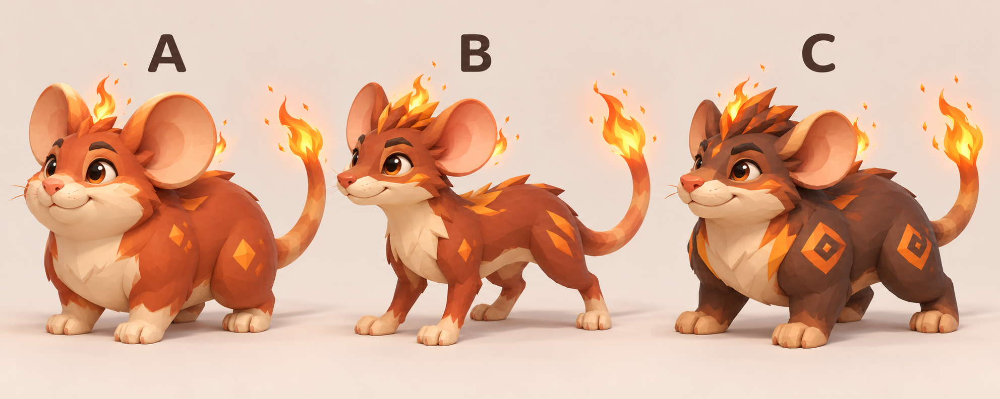

# 앰버랫 기본형 디자인 시안

- 최신 시안은 v2: 사용자 요청에 따라 꼬리 끝과 머리/귀 주변에 작은 불꽃을 추가했다.
- 이전 v1과 원본 프롬프트도 비교용으로 보존한다.

- 상태: 2026-10-07 사용자가 불꽃 수정 시안 B를 선택했다. A/C는 비교용 후보로 보존한다.
- A: 둥글고 통통한 체형, 큰 귀, 귀여운 인상.
- B: 길쭉한 체형, 날렵하고 활발한 인상.
- C: 단단한 체형, 짙은 몸색과 주황 무늬, 듬직한 인상.
- 세 안은 기본형의 서로 다른 후보이며 진화 단계가 아니다.
- B를 Roblox 기본 부품으로 재현한 3D 모델은 `dist/Emberrat-B.rbxmx`에 있으며, 포획 테스트 장소에도 포함한다. 이미지 파일과 게임 모델은 별도 파일이다.
- 생성 방식: 내장 `image_gen` 도구. 외부 모델/유료 API CLI는 사용하지 않았다.
- 원본 생성 프롬프트: [emberrat-base-options-v1.prompt.txt](emberrat-base-options-v1.prompt.txt)
- 불꽃 수정 프롬프트: [emberrat-base-options-v2-fire.prompt.txt](emberrat-base-options-v2-fire.prompt.txt)
