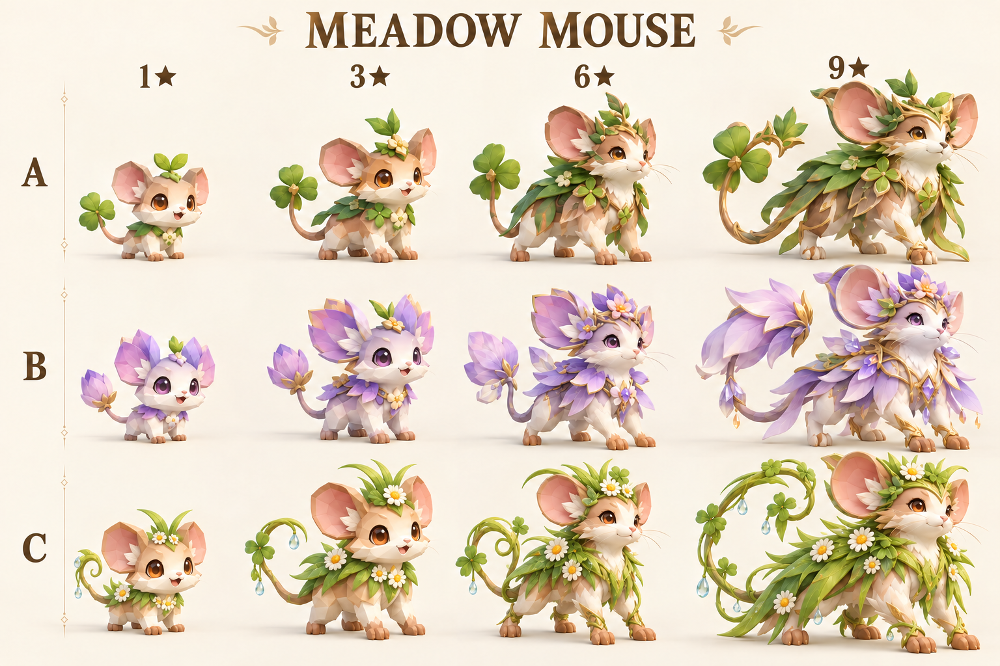
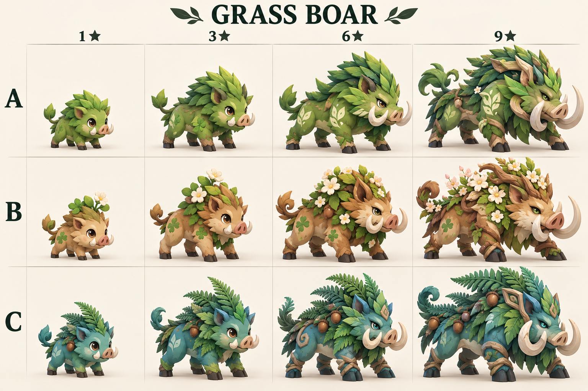
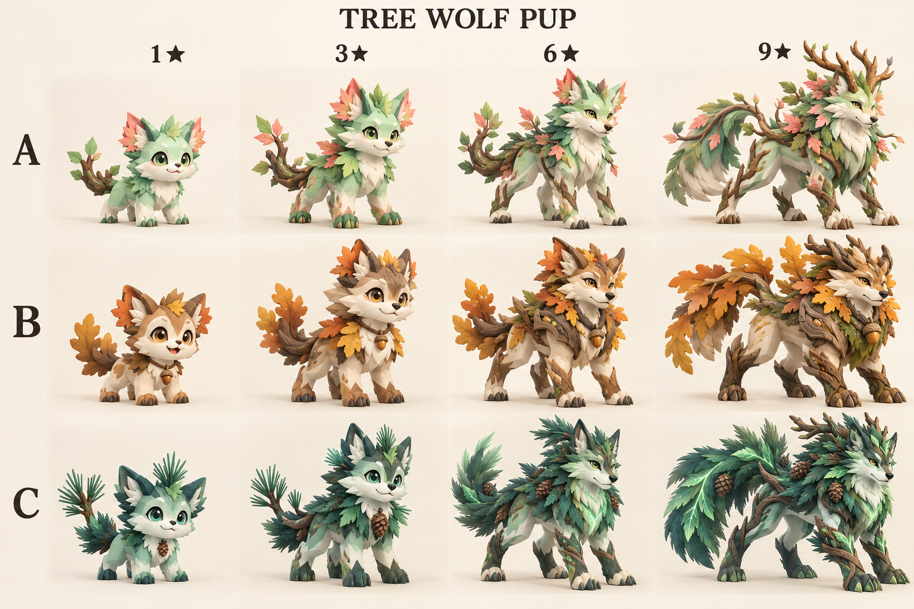
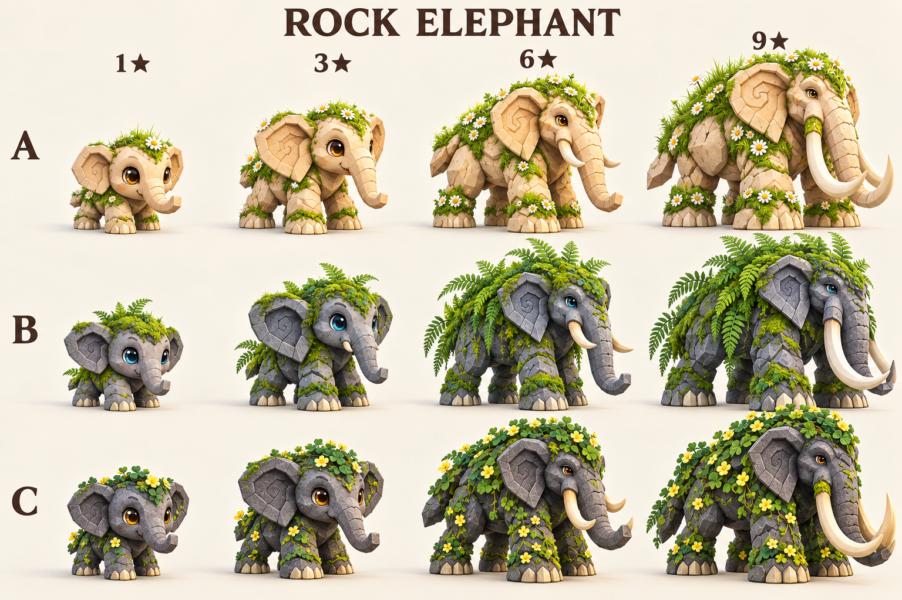
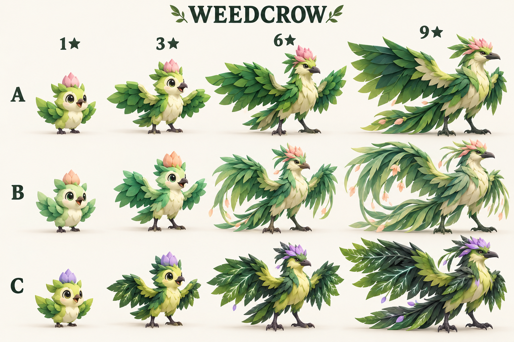

# 초원 몬스터 디자인 선택 시안

2026-10-08 · built-in image_gen / imagegen 스킬 사용. 아래는 **선택용 그림이며 Roblox에서 구동되는 3D 모델이나 최종 확정 외형이 아니다.** 5종마다 A/B/C 세 계열, 각 계열의1·3·6·9성, 총60개 모습을 비교한다.

새싹·풀·들꽃·이끼 등 초원 자연 요소를 우선했다. 꼬마쥐 C안과 바위코끼리 전체는 광물/수정 표현을 줄이고 초원 방향으로 수정했다. 초기 생성문과 최종 수정문은 [prompts.json](../assets/concepts/meadow/prompts.json)에 보관한다. 이 프롬프트에 제안된 장식은 새 능력/게임 규칙이 아니다.

| 이름 | A | B | C |
|---|---|---|---|
| 꼬마쥐 | 클로버·잎 망토 | 연보라 들꽃·꽃잎 | 풀잎·이슬·데이지 |
| 풀멧돼지 | 초록 풀 갈기 | 갈색·들꽃 | 청록 고사리 |
| 나무늑대강아지 | 연두 잎·가지 | 참나무 잎·도토리 | 짙은 침엽·솔방울 |
| 바위코끼리 | 밝은 돌·데이지 | 회색 돌·이끼·고사리 | 짙은 돌·클로버·노란 꽃 |
| 잡초까마귀 | 겹친 잎·분홍 볏 | 늘어진 잎·살구 볏 | 잎맥·보라 볏 |

사용자 확정: **5종 모두 A계열의 1/3/6/9성 전체**. B/C 그림은 삭제하지 않고 미래 변종/배합 몬스터 후보로 보관한다. 실제 배합 조합·능력·확률·시기는 미정이다. 전체 한 계열 또는 단계별 선택 가능. 서로 다른 계열을 고르면 얼굴/대표 특징이 이어지게 모델 단계에서 연결해야 한다. 이미지의 장식/성체 비율을 그대로 게임 능력으로 해석하지 않는다. 실제 모델은 애니메이션·충돌·8인 성능까지 별도 검사한다.

